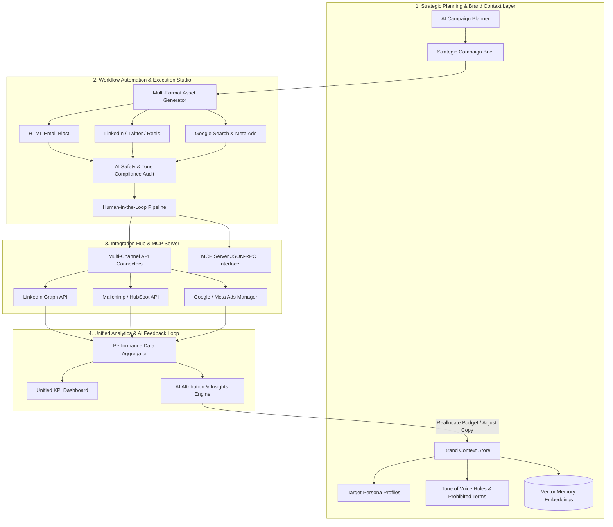

# Architecture & System Design Guide - Unified Campaign Engine (Nexus AI)

## Executive Overview

**Nexus AI Engine** is an enterprise-grade, **AI-native marketing and campaign execution engine**. Unlike traditional single-prompt AI tools, Nexus AI combines **Strategic Planning**, **Context-Grounded Multi-Format Asset Generation**, **Agentic Approval Workflows**, **MCP Integration Protocols**, and **Closed-Loop Performance Attribution**.

---

## Nexus AI vs. Ordinary LLM Calls

| Capability / Feature | Ordinary LLM Call (ChatGPT / Raw Prompt) | Nexus AI Campaign Engine |
| :--- | :--- | :--- |
| **Context & Memory** | Stateless; forgets brand rules after session ends | **Brand Context Vector Store**: Persists tone of voice, persona goals, negative keywords & vector embeddings memory |
| **Asset Output** | Unstructured plain text / markdown | **Channel-Native Multi-Format Studio**: Generates HTML emails, LinkedIn posts, Twitter threads, video scripts, Google & Meta Ads simultaneously |
| **Brand Safety & Compliance** | None; risk of hallucinations or forbidden buzzwords | **Automated Compliance Engine**: Runs parallel tone-of-voice, brand-safety, and spam-risk audits with 0–100% scoring |
| **Workflow & Human Review** | Manual copy-pasting into external tools | **Human-in-the-Loop Pipeline**: Kanban approval flow (`Draft` → `AI Audit` → `Manager Review` → `Scheduled` → `Published`) |
| **API & Channel Integration** | Manual publishing | **Integration Hub & MCP Server**: Direct API connectors (LinkedIn, Meta, Mailchimp) + Model Context Protocol (MCP) RPC server |
| **Optimization & Feedback** | None; static output | **Closed-Loop AI Attribution**: Synthesizes real-time performance analytics (CTR, ROI, conversions) and executes single-click budget optimizations |

---

## 4-Layer Software Architecture



---

## Layer-by-Layer Architectural Breakdown

### 1. Strategic Planning & Brand Context Layer
- **Brand Context Store**: Maintains brand identity, core enterprise values, and strict guardrails.
- **Target Personas & Vector Embeddings**: Stores granular technical profiles (e.g. *VP of Platform Engineering*, *Lead AI Application Architect*) and historical campaign learnings indexed in a vector similarity store.
- **AI Campaign Planner**: Converts high-level product goals (e.g. *"Launch Q3 Developer Product Feature"*) into structured campaign timelines, target channels, budgets, and target KPIs.

### 2. Multi-Format Studio & Agentic Workflows
- **Channel-Native Asset Generators**:
  - **Email**: Produces responsive HTML templates with inline CSS, subject line variations, and developer code snippets.
  - **LinkedIn & Twitter**: Produces technical thought leadership posts, threads, code block previews, and curated hashtag sets.
  - **Instagram / Reels**: Synthesizes timestamped short video scripts, voiceover cues, and visual prompts.
  - **Search & Social Ads**: Formats Google Search headline/description matrices and Meta carousel ad text.
- **AI Compliance & Safety Audit**: Evaluates every generated asset against tone rules, spam scores, and prohibited terms (e.g., *'guaranteed 100x'*, *'no code needed'*), providing a 0–100% compliance rating and feedback notes.
- **Human-in-the-Loop Kanban Pipeline**: Enforces governance nodes (`Draft` → `AI Compliance Check` → `Manager Approval` → `Scheduled Queue` → `Published`), preventing unapproved posts from reaching channels.

### 3. Integration Hub & Model Context Protocol (MCP) Server
- **Two-Way API Connectors**: Handles OAuth authentication, rate limiting, and publishing payloads for LinkedIn, Twitter/X API v2, Meta Graph API, Google Ads, and Mailchimp/HubSpot.
- **Model Context Protocol (MCP) Server**: Exposes standard JSON-RPC endpoints (`/api/integrations/mcp`) allowing external autonomous AI agents or IDE assistants to inspect campaign status, schedule posts, or query performance metrics.

### 4. Unified Analytics & AI Attribution Feedback Loop
- **Cross-Channel Data Aggregator**: Aggregates impressions, clicks, CTR, conversions, ad spend, and net ROI into a consolidated dataset visualized via Recharts.
- **AI Attribution & Insights Engine**: Continuously analyzes performance discrepancies between channels.
- **Closed-Loop Autonomous Action**: Synthesizes actionable recommendations (e.g., *"Email CTR is 18.5% while Meta ROI dropped to 1.6x -> Reallocate $200/wk to email retargeting"*). When the manager clicks **"Apply Recommendation"**, the system re-balances channel budgets and updates campaign execution live.

---

## Data Models & API Interface

### Brand Context Schema (`/api/brand`)
```typescript
interface BrandContext {
  id: string;
  name: string;
  tagline: string;
  toneOfVoice: string[];
  prohibitedTerms: string[];
  targetPersonas: Persona[];
  pastLearnings: string[];
  vectorEmbeddingsCount: number;
}
```

### Campaign Plan Schema (`/api/campaigns/plan`)
```typescript
interface CampaignPlan {
  id: string;
  title: string;
  productUrl: string;
  objective: string;
  targetAudience: string;
  budget: number;
  channels: ChannelType[];
  kpis: CampaignKPI[];
}
```

### Asset & Compliance Schema (`/api/assets/generate`)
```typescript
interface AssetItem {
  id: string;
  campaignId: string;
  channel: ChannelType;
  title: string;
  stage: 'draft' | 'ai_compliance' | 'manager_approval' | 'scheduled' | 'published';
  content: AssetContent;
  complianceScore: number;
  complianceChecks: ComplianceCheck[];
}
```

---

## How to Run the Architecture Full-Stack

1. **Start Express Backend (`:5000`) + Vite React Frontend (`:3000`)**:
   ```bash
   npm run dev:full
   ```
2. **Backend API Health Check**:
   `http://localhost:5000/api/health`
