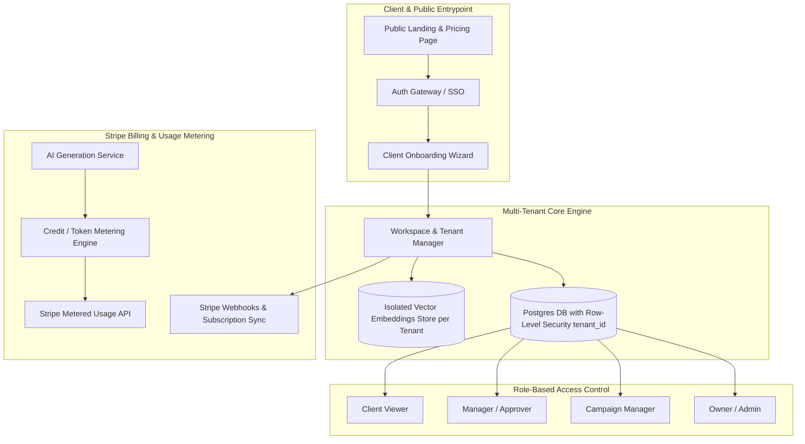

# B2B SaaS Transformation & Client Onboarding Blueprint

This document outlines the blueprint to turn the **Unified Campaign Engine** into a multi-tenant B2B SaaS platform with automated client onboarding, Stripe billing, usage metering, and multi-tenant data isolation.

---

## 1. High-Level SaaS Architecture



---

## 2. Multi-Tenant Data Isolation Strategy

To securely isolate data between competing clients/brands, every database query and vector memory search must enforce `tenant_id` scoping.

### Relational Schema (PostgreSQL + Prisma / Drizzle)

```sql
-- Tenants / Organizations Table
CREATE TABLE tenants (
    id UUID PRIMARY KEY DEFAULT gen_random_uuid(),
    name VARCHAR(255) NOT NULL,
    slug VARCHAR(255) UNIQUE NOT NULL,
    stripe_customer_id VARCHAR(255),
    subscription_status VARCHAR(50) DEFAULT 'trialing',
    created_at TIMESTAMP WITH TIME ZONE DEFAULT NOW()
);

-- Workspace Users & RBAC
CREATE TABLE workspace_members (
    id UUID PRIMARY KEY DEFAULT gen_random_uuid(),
    tenant_id UUID REFERENCES tenants(id) ON DELETE CASCADE,
    user_id UUID NOT NULL,
    role VARCHAR(50) CHECK (role IN ('owner', 'admin', 'marketer', 'approver', 'viewer')),
    created_at TIMESTAMP WITH TIME ZONE DEFAULT NOW()
);

-- Scoped Brand Context Store
CREATE TABLE brand_contexts (
    id UUID PRIMARY KEY DEFAULT gen_random_uuid(),
    tenant_id UUID REFERENCES tenants(id) ON DELETE CASCADE UNIQUE,
    brand_name VARCHAR(255) NOT NULL,
    website_url TEXT,
    tone_rules JSONB DEFAULT '[]'::jsonb,
    prohibited_terms JSONB DEFAULT '[]'::jsonb,
    created_at TIMESTAMP WITH TIME ZONE DEFAULT NOW()
);

-- Vector Embeddings Memory Isolation (pgvector)
CREATE TABLE brand_vector_embeddings (
    id UUID PRIMARY KEY DEFAULT gen_random_uuid(),
    tenant_id UUID REFERENCES tenants(id) ON DELETE CASCADE,
    content TEXT NOT NULL,
    embedding VECTOR(1536), -- OpenAI text-embedding-3-small
    metadata JSONB
);

-- Enable Row Level Security (RLS)
ALTER TABLE brand_contexts ENABLE ROW LEVEL SECURITY;
CREATE POLICY tenant_isolation_policy ON brand_contexts
    USING (tenant_id = current_setting('app.current_tenant_id')::uuid);
```

---

## 3. Subscription Pricing Tiers & Metered Usage

| Tier Name | Monthly Price | Included AI Credits | Channels Supported | Features Included |
| :--- | :--- | :--- | :--- | :--- |
| **Starter** | **$99 / mo** | 500 Credits / mo | Email, LinkedIn, Twitter | 1 Brand Workspace, AI Compliance Auditor, 3 Team Seats |
| **Growth** | **$299 / mo** | 2,500 Credits / mo | All Channels (Inc. Ads & Reels) | 3 Brand Workspaces, MCP Server API Access, Human Approval Pipeline, 10 Seats |
| **Enterprise** | **$899+ / mo** | Custom Unlimited | All Channels + Custom Connectors | Unlimited Brands, Dedicated Vector Memory, Custom SSO / SAML, SLA |

### Metering Credit System:
- **Campaign Brief Generation**: 10 Credits
- **Multi-Format Asset Package**: 25 Credits
- **AI Compliance Audit & Regeneration**: 5 Credits per variant
- **Overage Metering**: $0.05 per additional credit billed automatically via Stripe Metered Usage API.

---

## 4. Automated 4-Step Client Onboarding Flow

```
Step 1: Account Creation & Org Setup
└── User signs up -> Express Backend creates Tenant record & Stripe Customer.

Step 2: Instant Brand Ingestion (URL Scraping + Vectorization)
└── User enters product URL (e.g. https://clientwebsite.com)
    └── Backend scrapes HTML/metadata, extracts tone & keywords via LLM
    └── Converts learnings into 1,500+ vector embeddings in tenant's vector store.

Step 3: Team Invitation & Role Assignment
└── Admin invites team members via email link -> Assigned role (Approver, Marketer).

Step 4: Interactive Guided First Campaign Setup
└── Auto-generates starter campaign brief -> Client reviews live previews.
```

---

## 5. Express Backend Code Implementation Plan for SaaS

### A. Stripe Webhook Listener ([server/routes/billing.js](file:///home/pankajpandey/workspace/campaign-engine/server/routes/billing.js))

```javascript
import { Router } from 'express';
import Stripe from 'stripe';

const stripe = new Stripe(process.env.STRIPE_SECRET_KEY);
const router = Router();

// Create Checkout Session for Onboarding
router.post('/create-checkout-session', async (req, res) => {
  const { tenantId, priceId } = req.body;

  const session = await stripe.checkout.sessions.create({
    payment_method_types: ['card'],
    mode: 'subscription',
    line_items: [{ price: priceId, quantity: 1 }],
    success_url: `${process.env.FRONTEND_URL}/onboarding?session_id={CHECKOUT_SESSION_ID}`,
    cancel_url: `${process.env.FRONTEND_URL}/pricing`,
    metadata: { tenantId }
  });

  res.json({ url: session.url });
});

// Stripe Webhook Endpoint for Auto-Provisioning
router.post('/webhook', express.raw({ type: 'application/json' }), async (req, res) => {
  const sig = req.headers['stripe-signature'];
  let event;

  try {
    event = stripe.webhooks.constructEvent(req.body, sig, process.env.STRIPE_WEBHOOK_SECRET);
  } catch (err) {
    return res.status(400).send(`Webhook Error: ${err.message}`);
  }

  if (event.type === 'checkout.session.completed') {
    const session = event.data.object;
    const tenantId = session.metadata.tenantId;

    // Activate Tenant Account & Provision Subscription Credits
    await activateTenantSubscription(tenantId, session.subscription);
  }

  res.json({ received: true });
});

export default router;
```

### B. Tenant Context Middleware ([server/middleware/authTenant.js](file:///home/pankajpandey/workspace/campaign-engine/server/middleware/authTenant.js))

```javascript
import jwt from 'jsonwebtoken';

export const authTenant = (req, res, next) => {
  const authHeader = req.headers.authorization;
  if (!authHeader) return res.status(401).json({ error: 'Missing authorization token' });

  const token = authHeader.split(' ')[1];
  try {
    const decoded = jwt.verify(token, process.env.JWT_SECRET);
    req.tenantId = decoded.tenantId;
    req.userId = decoded.userId;
    req.role = decoded.role;
    next();
  } catch (err) {
    res.status(403).json({ error: 'Invalid or expired token' });
  }
};
```

---

## 6. Implementation Checklist & Next Steps

- [ ] **Step 1: Database Setup**: Add PostgreSQL + Drizzle ORM / Prisma with `tenant_id` columns and Row Level Security.
- [ ] **Step 2: Authentication**: Integrate Auth0, Supabase Auth, or JWT middleware.
- [ ] **Step 3: Stripe Billing**: Integrate Stripe Checkout, Customer Portal, and Webhook listener (`server/routes/billing.js`).
- [ ] **Step 4: Automated Onboarding Wizard**: Build multi-step onboarding wizard in React (`src/components/onboarding/OnboardingWizard.tsx`).
- [ ] **Step 5: Usage Metering**: Track credits on each `/api/campaigns/plan` and `/api/assets/generate` API call.
